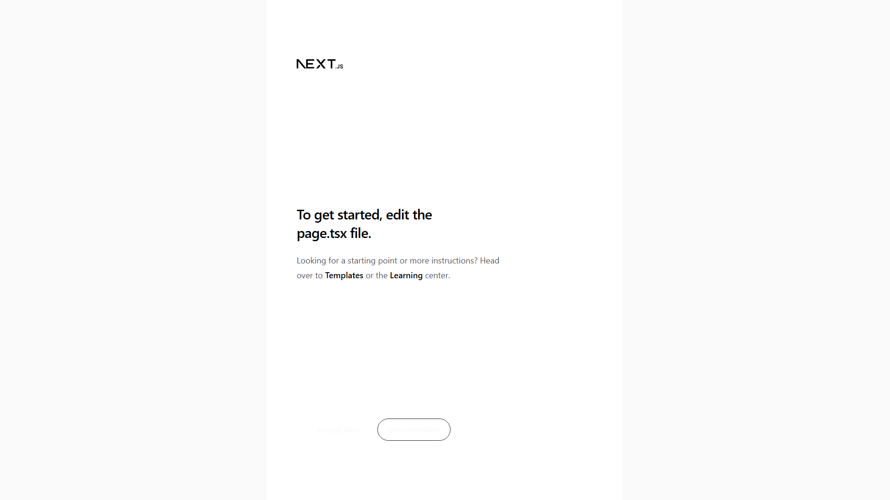

# Liar or Fire 🔥

<div align="center">
  
  
  **Is it worth the hype? Vote and find out.**
  
  [](https://nextjs.org)
  [](https://react.dev)
  [](https://tailwindcss.com)
</div>

---

## 📸 Screenshots

| Landing Page | Voting Interface |
|--------------|------------------|
|  | Vote 🔥 for hot, 🤥 for fake, or 🗑️ for trash |

---

## 🎯 About

**Liar or Fire** is a community-driven voting platform where users vote on products, services, and trends to determine if they're worth the hype.

### Vote Options

| Emoji | Meaning | Description |
|-------|---------|-------------|
| 🔥 | **Fire** | This is amazing! Worth every penny! |
| 🤥 | **Liar** | Overhyped, doesn't deliver on promises |
| 🗑️ | **Trash** | Avoid at all costs, total waste |

---

## ✨ Features

| Feature | Description |
|---------|-------------|
| **🔥 Fire Vote** | Vote something as "fire" - amazing and worth it |
| **🤥 Liar Vote** | Vote something as "liar" - overhyped and misleading |
| **🗑️ Trash Vote** | Vote something as "trash" - avoid completely |
| **💬 Comments** | Share your experience with others |
| **📊 Vote Stats** | See how others voted |
| **🔍 Search** | Find products, services, and trends |
| **📱 Mobile Responsive** | Works on all devices |

---

## 🚀 Getting Started

### Prerequisites

- Node.js 22+
- npm or pnpm

### Installation

1. **Clone the repository**
   ```bash
   git clone https://github.com/Porfirio-Piero/liar-or-fire.git
   cd liar-or-fire
   ```

2. **Install dependencies**
   ```bash
   npm install
   ```

3. **Start the development server**
   ```bash
   npm run dev
   ```

4. **Open your browser**
   Navigate to [http://localhost:3000](http://localhost:3000)

---

## 📁 Project Structure

```
liar-or-fire/
├── src/
│   ├── app/              # Next.js App Router
│   │   ├── page.tsx      # Main voting page
│   │   ├── layout.tsx    # Root layout
│   │   └── globals.css   # Global styles (fire/liar/trash effects)
│   ├── components/       # React components
│   │   ├── ui/           # UI components
│   │   └── VoteCard.tsx  # Voting card component
│   └── lib/              # Utilities
├── public/               # Static assets
└── next.config.ts        # Next.js configuration
```

---

## 🛠️ Tech Stack

| Category | Technology |
|----------|------------|
| **Framework** | Next.js 16 (App Router) |
| **Language** | TypeScript 5 |
| **UI Library** | React 19 |
| **Styling** | Tailwind CSS 4 |
| **UI Components** | shadcn/ui (Radix) |
| **Icons** | Lucide React |
| **Animations** | tailwindcss-animate |
| **Deployment** | Vercel |

---

## 🎨 Design Features

### Fire Glow Effect
```css
.fire-glow {
  box-shadow: 
    0 0 20px hsl(var(--fire) / 40%),
    0 0 40px hsl(var(--fire) / 20%),
    0 0 60px hsl(var(--fire) / 10%);
}
```

### Liar Glow Effect
```css
.liar-glow {
  box-shadow: 
    0 0 20px hsl(var(--liar) / 40%),
    0 0 40px hsl(var(--liar) / 20%),
    0 0 60px hsl(var(--liar) / 10%);
}
```

---

## 🧪 Development

```bash
# Run development server
npm run dev

# Run linting
npm run lint

# Build for production
npm run build

# Start production server
npm start
```

---

## 🗺️ Roadmap

- [ ] User authentication
- [ ] Comment system
- [ ] Vote history
- [ ] Leaderboards
- [ ] Categories (Products, Services, Apps)
- [ ] API for integrations
- [ ] Mobile app

---

## 🤝 Contributing

Contributions are welcome! Please feel free to submit a Pull Request.

1. Fork the repository
2. Create your feature branch (`git checkout -b feature/amazing-feature`)
3. Commit your changes (`git commit -m 'feat: add amazing feature'`)
4. Push to the branch (`git push origin feature/amazing-feature`)
5. Open a Pull Request

---

## 📄 License

MIT License - feel free to use this for your own voting platform!

---

## 🙏 Acknowledgments

- [Next.js](https://nextjs.org/) - The React Framework
- [Tailwind CSS](https://tailwindcss.com/) - Utility-first CSS
- [shadcn/ui](https://ui.shadcn.com/) - Beautiful UI components
- [Lucide](https://lucide.dev/) - Beautiful icons

---

<div align="center">
  Made with ❤️ by <a href="https://github.com/Porfirio-Piero">Porfirio-Piero</a>
  
  **[⬆ Back to Top](#liar-or-fire-)**
</div>